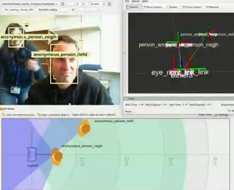

# ROS4HRI: Bridging Human-Robot Interaction with ROS

  

![ROS4HRI banner][ros4hri_ids.png]

## 🤖❤️🤗 What is ROS4HRI?  

ROS4HRI is a collection of open-source resources built around the [Human-Robot
Interaction (HRI)](http://wiki.ros.org/hri) paradigm — enabling robots to
meaningfully perceive, interpret and respond to humans in shared spaces and
applications.

At its heart, ROS4HRI is a set of ROS 1/ROS 2-compatible conventions, libraries, and tools
designed to streamline the development of HRI systems. It aligns and implements
the [ROS REP-155](https://www.ros.org/reps/rep-0155.html).

Within this organization you’ll find standard implementations and libraries for
the REP-155 messages and abstractions, as well as modules for human skeleton
tracking, face detection, full-body modeling, engagement estimation, and other
key components for HRI applications. (See the list of repositories below.)

Relevant academic references include:

- Mohamed, Lemaignan, [ROS for Human-Robot Interaction](https://doi.org/10.1109/IROS51168.2021.9636816)
- Ros, Lemaignan, Ferrini, Andriella, Irisarri, [ROS4HRI: Standardising an Interface for Human-Robot Interaction](https://academia.skadge.org/publis/ros2023ros4hri.pdf)
- Lemaignan, Ferrini, [Probabilistic fusion of persons' body features: the Mr. Potato algorithm](https://doi.org/10.1145/3610977.3637479)
- Lemaignan, Ferrini, Gebelli, Ros, Juricic, Cooper, [Hands-on: From Zero to an Interactive Social Robot using ROS4HRI and LLMs](https://doi.org/10.1109/HRI61500.2025.10974214)
- Alameda-Pineda et al., [Socially Pertinent Robots in Gerontological Healthcare](https://doi.org/10.1007/s12369-025-01330-6) (first real-world deployment of a full autonomous robot using ROS4HRI)

## 🎯 Why ROS4HRI?  

- **Modularity** – Every component follows the ROS ecosystem and can be integrated into your pipelines.  
- **Standardization** – A consistent message/specification set so different modules speak the same “HRI language”.  
- **Flexibility** – You can pick the pieces you need (face detection, body modelling, human description…) and build from there.  
- **Open Collaboration** – Built to be extended, adapted and contributed to by the wider robotics and HRI research community.

## 📂 Key Repositories  

Here are some of the main modules you’ll find here:  
- **[hri_msgs](https://github.com/ros4hri/hri_msgs)** and **[hri_actions_msgs](https://github.com/ros4hri/hri_actions_msgs)** – ROS message definitions specific to human-robot interaction.  
- **[libhri](https://github.com/ros4hri/libhri)** – A Python/C++ API library wrapping ROS4HRI topics to simplify perception access.  
- **[human_description](https://github.com/ros4hri/human_description])** – A URDF-based kinematic model for representing humans in ROS.
- **[hri_rviz](https://github.com/ros4hri/hri_rviz)** – RViz plugins for visualizing HRI-specific data (human models, 3D skeletons, etc).
- **[hri_body_detect](https://github.com/ros4hri/hri_body_detect)** – A Python node for extracting 2D/3D skeletons of humans from RGB/RGB-D cameras.  
- **[hri_face_detect](https://github.com/ros4hri/hri_face_detect)** – A ROS-conformant node for detecting faces, extracting facial landmarks and estimating head pose.  
- …and many more specialized modules (emotion recognizer, engagement estimator, interaction simulators).

## 🧭 Getting Started  

1. Choose the repository that fits your need (face, body, engagement, etc).  
2. Clone the repo, install any dependencies listed in that module’s README.  
3. Launch the ROS node(s) as described in the repo.  
4. Subscribe to the published topics (e.g., human skeleton, engagement score) and integrate with your robot/system logic.  
5. Extend or adapt — build your own HRI workflows on top of these modules.

## 🤝 Contributing  
We welcome contributions of all kinds: bug-reports, feature requests, pull-requests, documentation improvements, and new HRI modules.  
To contribute:  
- Fork the target repository.  
- Create a feature or fix branch.  
- Make sure your code follows the existing style conventions and passes any included tests.  
- Submit a Pull Request and reference the issue(s) it addresses.  
- Engage in review — we aim for clarity, correctness and maintainability.

## 📢 Stay Connected  
- Check the **Issues** tab of each repository for upcoming work and current priorities.  
- If you build an HRI use-case with ROS4HRI, we’d love to hear about it — drop a link or case study.  
- Consider citing this organization/modules in your research or project publications when relevant.

## 📝 License  

Unless otherwise stated in a specific module, all material in this organisation
is available under the [Apache License, Version 2.0](LICENSE) — see each
repository for details.

